# Diagram previews

[Customization map](customization-map.md) · [Personal data sources and local connections](local-data-connections.md)

Editable source: [mycelium-architecture.drawio](mycelium-architecture.drawio). SVG nodes link to source code. Solid ER arrows are declared foreign keys from child to parent with delete actions; dashed arrows are logical application joins. Gray nodes reference another domain.

## Runtime / script architecture

[Open SVG](01-runtime.svg)

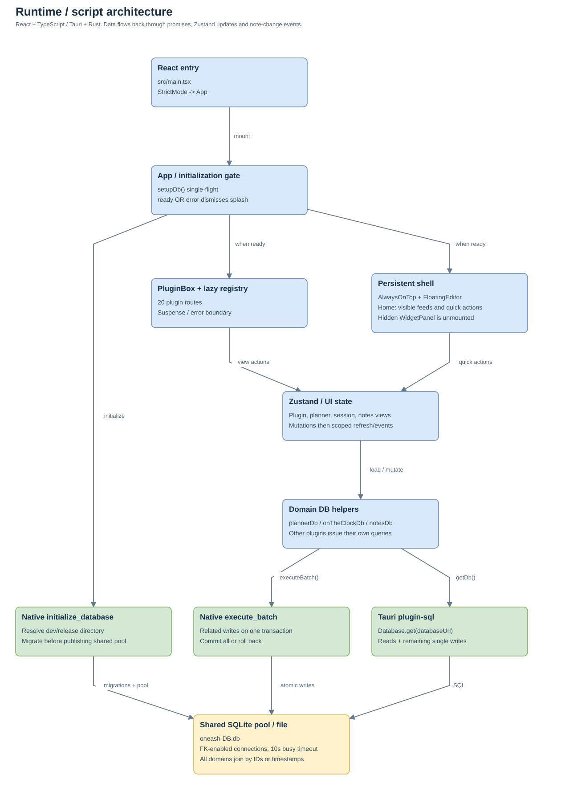

## Storage boundaries / personal inputs

[Open SVG](02-storage.svg)

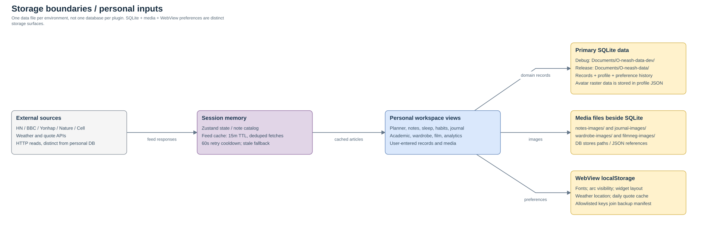

## Planner / projects / task graph

[Open SVG](03-planner.svg)

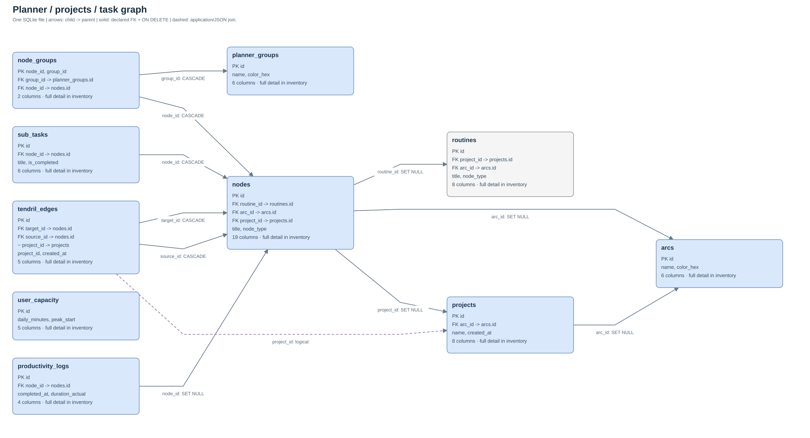

## Routine templates / rules

[Open SVG](04-routines.svg)

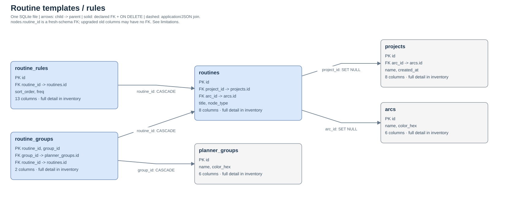

## On the Clock / session effort

[Open SVG](05-sessions.svg)

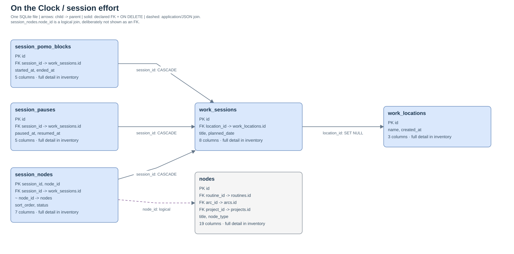

## Notes / wiki graph / aliases

[Open SVG](06-notes.svg)

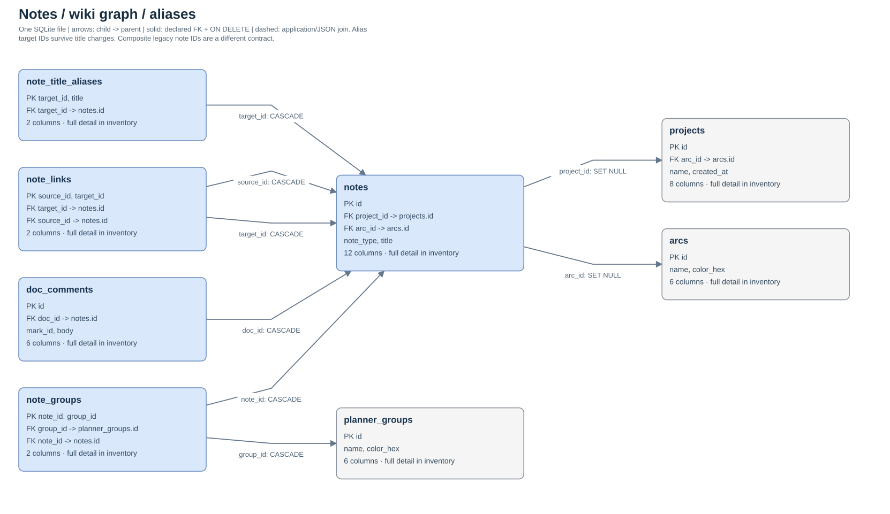

## Personal tracking / migration ledger

[Open SVG](07-personal.svg)

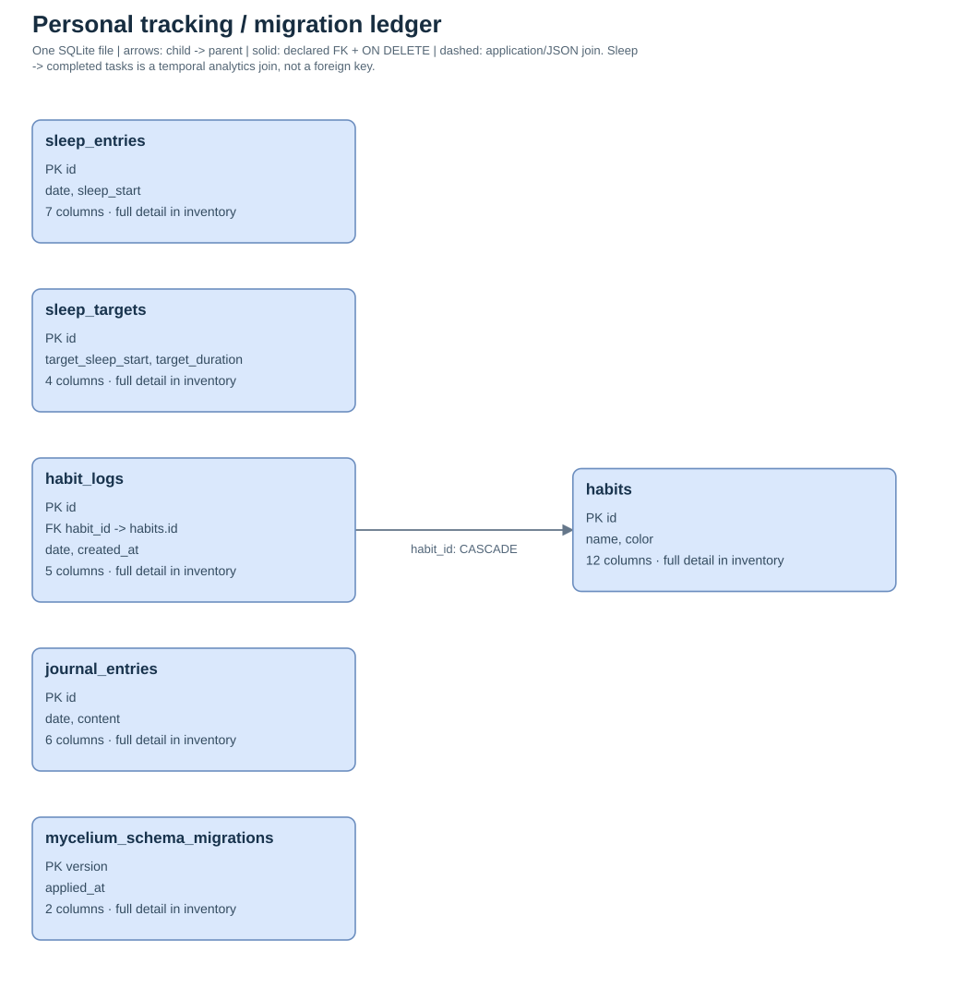

## Academic canvases / shared tasks

[Open SVG](08-academic.svg)

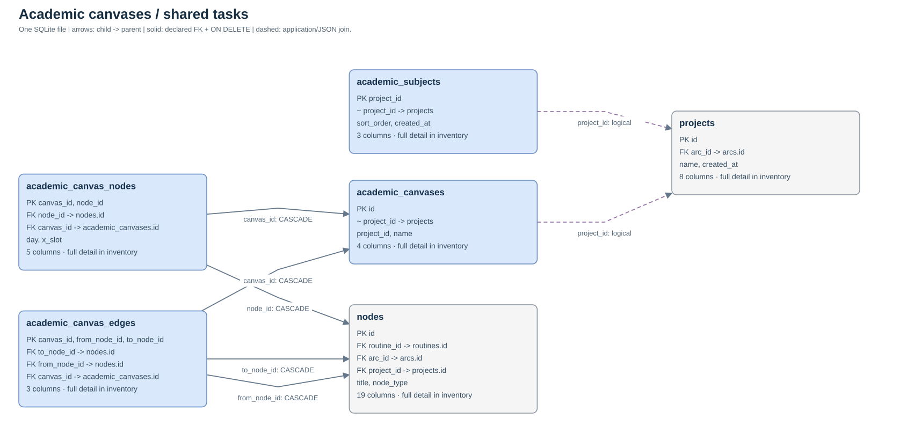

## Dispatch / work blocks

[Open SVG](09-dispatch.svg)

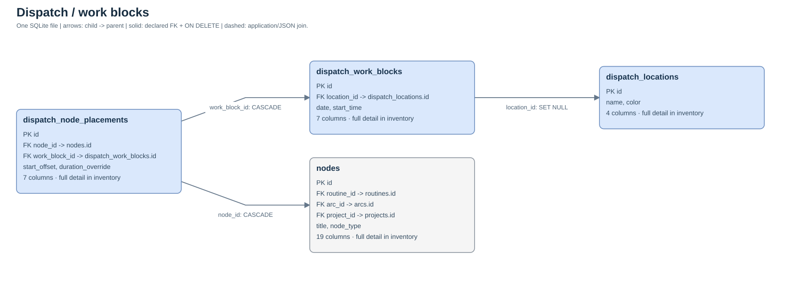

## Wardrobe / wiki / daily outfits

[Open SVG](10-wardrobe.svg)

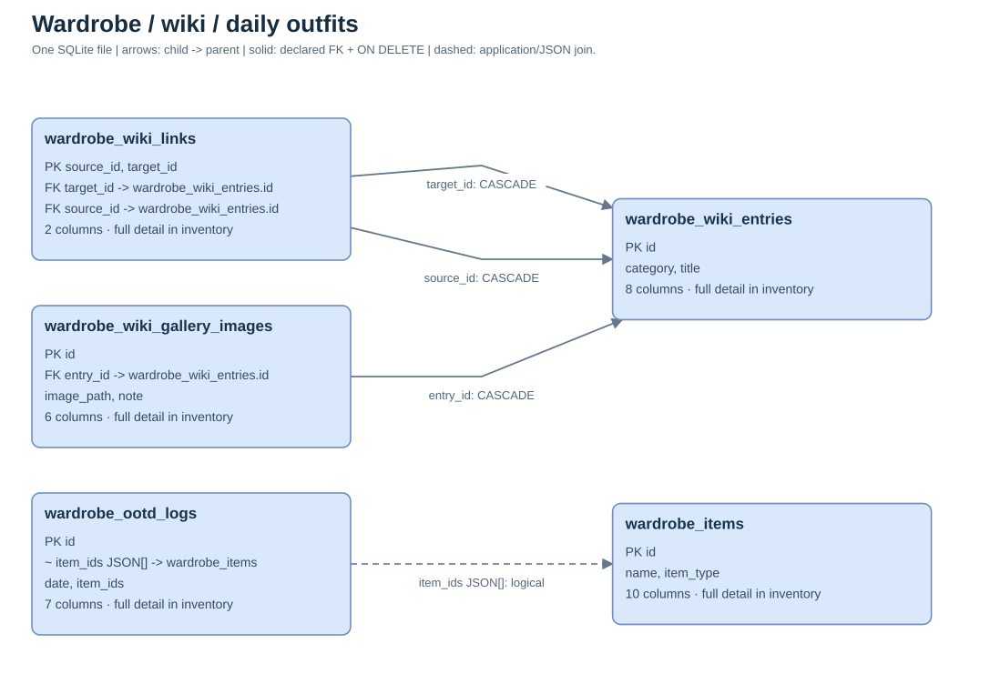

## Film Neg Lab / photos / trails

[Open SVG](11-film.svg)

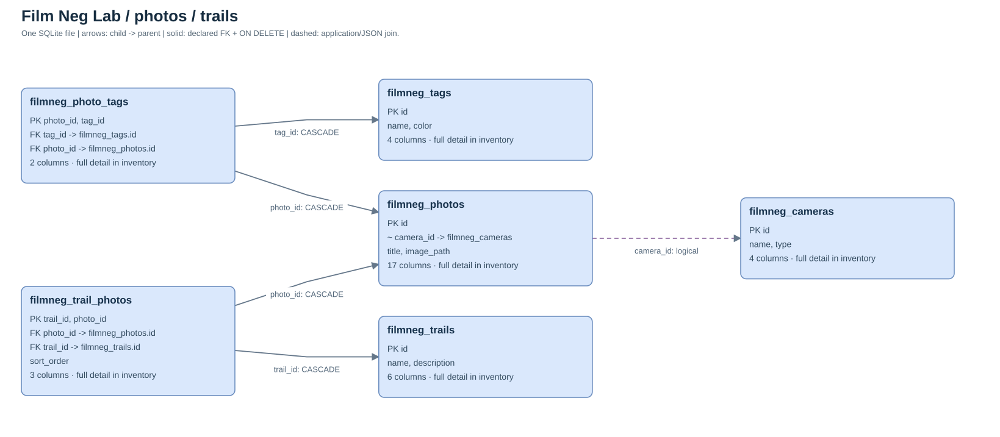

## Personal analytics / logical joins

[Open SVG](12-analytics.svg)

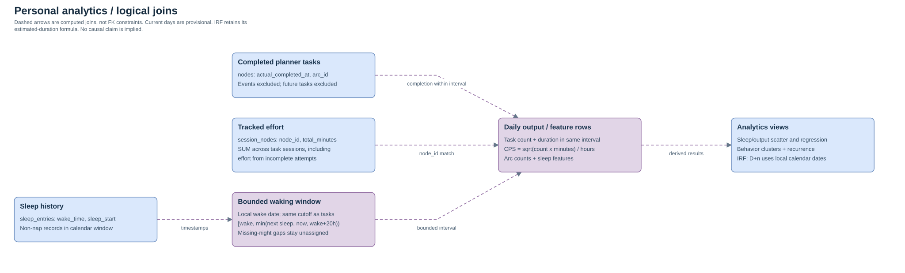

## Personal profile / preference history

[Open SVG](13-preferences.svg)

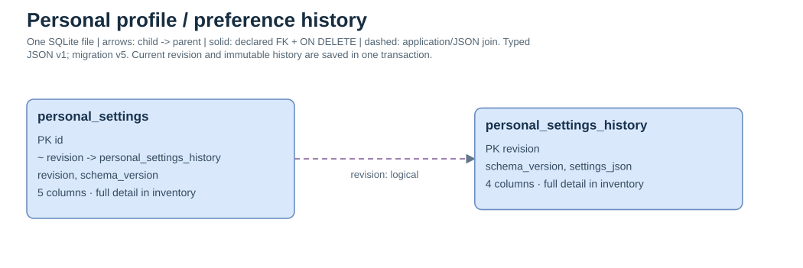
